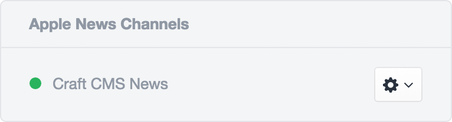
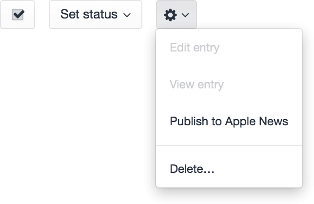

# Apple News for Craft CMS

This plugin provides an Apple News integration for Craft CMS, making it possible to publish your content to iPhone and iPad owners around the world.


## Requirements

Apple News for Craft CMS requires Craft CMS 2 and PHP 5.4 or later.


## Before You Begin

You will need at least one active Apple News channel. Visit the [iCloud News Publisher](https://www.icloud.com/#newspublisher) website to create one. Note that new channels must go through a quick approval process before they can be used.


## Installation

To install Apple News for Craft CMS, follow these steps:

1.  Upload the `applenews` folder to your `craft/plugins` folder.
2.  Go to Settings > Plugins from your Craft control panel and install the Apple News plugin.


## Configuration

Apple News for Craft CMS gets its own configuration file, located at `craft/config/applenews.php`. It can have the following config settings:

- **channels** – An array of Channel class configurations, which define the Apple News channels that the plugin should post articles to. Each configuration can be defined in one of the following ways:
    - A fully qualified class name, in which case an instance of the class will be automatically created. (Note that in this case it is your responsibility to make that class autoloadable.)
    - A class path alias, e.g. `plugins.myplugin.MyNewsChannel` or `applenewschannels.MyNewsChannel`. The `applenewschannels` alias points to a `craft/applenewschannels` folder you can create. (Note that classes that belong to a plugin should use the `Craft` namespace, but classes that live in the `craft/applenewschannels` folder should use the global namespace.)
    - An array which includes a `class` key that is either a fully qualified class name or a class path alias, and may also include additional name-value pairs that the object will be initialized with.
- **autoPostOnSave** – A boolean that indicates whether entries should be automatically posted to Apple News whenever they are saved. (Default is `true`.)

Here’s an example plugin config, which defines one Apple News channel using a `MyNewsChannel` class, and defines its `$channelId`, `$apiKeyId`, and `$apiSecret` properties right from the class configuration.

```php
<?php

return [
    'channels' => [
        [
            'class'     => 'applenewschannels.MyNewsChannel',
            'channelId' => 'xxxxxxxx-xxxx-xxxx-xxxx-xxxxxxxxxxxx',
            'apiKeyId'  => 'xxxxxxxx-xxxx-xxxx-xxxx-xxxxxxxxxxxx',
            'apiSecret' => 'xxxxxxxxxxxxxxxxxxxxxxxxxxxxxxxxxxxxxxxxxxxx',
        ],
    ],
];

```


## Channel Class Definition

Each Channel class must implement the [Craft\IAppleNewsChannel](https://github.com/pixelandtonic/AppleNews/blob/master/applenews/IAppleNewsChannel.php) interface. These classes tell the plugin everything it needs to know to start posting content to corresponding Apple News channel. For your convenience, a base class that implements the interface is provided at [Craft\BaseAppleNewsChannel](https://github.com/pixelandtonic/AppleNews/blob/master/applenews/BaseAppleNewsChannel.php).


An example Channel class is provided at [applenewschannels/MyNewsChannel.php](https://github.com/pixelandtonic/AppleNews/blob/master/applenewschannels/MyNewsChannel.php), which will more or less work with the “News” section within the [Happy Lager demo site](https://github.com/pixelandtonic/HappyLager).


## Usage

Once your Channel classes are set up and included properly, a new “Apple News Channels” pane appear in the right column of Edit Entry pages, for entries that have at least one matching channel.



Each channel will display an action menu beside it with some of the following options, depending on the state of the article:

- **Post to Apple News** – Queues the article to be posted to Apple News.
- **Copy share URL** – Displays a prompt that allows the user to copy the article’s share URL. If the URL is accessed on an iOS device, it will launch the News app and bring you to the article.
- **Download for News Preview** – Downloads the entry’s article.json (and other files), which can be loaded into the [News Preview](https://developer.apple.com/news-preview/) app, to see exactly how your article will look on various iOS devices once published.

There will also be a new “Post to Apple News” bulk action on the Entries index page, which makes it possible to queue up several entries to be published at once.




## Caveats

Please be aware of the following caveats:

- At this time there is no way to schedule an entry to be pushed to Apple News in the future, nor does Apple News support articles with publish dates set to the future. So if you save an entry with a Post Date set in the future, you will have to manually re-save the entry later on for it to actually get pushed to Apple News.


## Roadmap

The following features are planned:

- Error handling and reporting
- Support for posting previews of otherwise unpublishable entries
- Move article deletion to a queue + BG task
