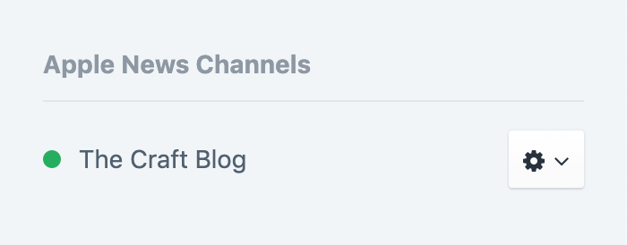

[](https://codecov.io/gh/craftcms/apple-news)

<p align="center"></p>

<h1 align="center">Apple News</h1>

This plugin provides an [Apple News](https://www.apple.com/ca/apple-news/) integration for Craft CMS, making it possible to publish your content to iPhone, iPad, and Mac users around the world.

## Before You Begin

Before you can start publishing to Apple News, you’ll need to sign up for [News Publisher](https://www.icloud.com/newspublisher/) and create your first channel. Make sure you choose to publish with **Apple News Format** when asked. Note that new channels must go through an approval process before they can be used.

Once you’ve created a channel, you’ll need to write down its Channel ID and API credentials. You can get those from **Settings** → **Channel Info** → **Connect CMS** → **API Key** in News Publisher.

## Requirements

This plugin requires Craft CMS 4.2.0 or later.

## Installation

You can install this plugin from the Plugin Store or with Composer.

#### From the Plugin Store

Go to the Plugin Store in your project’s Control Panel and search for **Apple News**. Then click on the **Install** button in its modal window.

#### With Composer

Open your terminal and run the following commands:

```bash
# go to the project directory
cd /path/to/my-project.test

# tell Composer to load the plugin
composer require craftcms/apple-news

# tell Craft to install the plugin
./craft install/plugin apple-news
```
## Configuration

Publish to Apple News gets its own configuration file, located at `config/apple-news.php`. It can have the following config settings:

- `channels` _(array)_ – List of [channel class](#channel-classes) configs
- `autoPublishOnSave` _(bool)_ – Whether entries should be automatically published to Apple News whenever they are saved (`true` by default)

Here’s an example:

```php
<?php

return [
    'channels' => [
        [
            'class' => applenewschannels\MyNewsChannel::class,
            'channelId' => craft\helpers\App::env('NEWS_CHANNEL_ID'), // xxxxxxxx-xxxx-xxxx-xxxx-xxxxxxxxxxxx
            'apiKeyId' => craft\helpers\App::env('NEWS_API_KEY'),     // xxxxxxxx-xxxx-xxxx-xxxx-xxxxxxxxxxxx
            'apiSecret' => craft\helpers\App::env('NEWS_API_SECRET'), // xxxxxxxxxxxxxxxxxxxxxxxxxxxxxxxxxxxxxxxxxxxx
        ],
    ],
];
```

## Channel Classes

Channel classes tell the plugin everything it needs to know to start publishing content Apple News. They should should extend [craft\applenews\BaseChannel](https://github.com/craftcms/apple-news/blob/master/src/BaseChannel.php).

We recommend that you save your channel classes in `config/apple-news-channels` and use an `applenewschannels` namespace.

```php
<?php
namespace applenewschannels;
// ...
```

An example channel class is provided at [apple-news-channels/MyNewsChannel.php](https://github.com/craftcms/apple-news/blob/master/apple-news-channels/MyNewsChannel.php), which will more or less work with the “News” section within the [Happy Lager demo site](https://github.com/craftcms/demo).

### Autoloading your Channel Classes

To make your channel classes auto-loadable, add a new [autoload root](https://getcomposer.org/doc/04-schema.md#autoload)  to `composer.json` for your channel and article classes, and then run `composer dump-autoload`.

```json
{
   "autoload": {
       "psr-4": {
           "applenewschannels\\": "config/apple-news-channels/"
       }
   }
}
```

## Usage

Once your Channel classes are set up and included properly, a new **Apple News Channels** area appear in the details pane of Edit Entry pages, for entries that have at least one matching channel.



Each channel will display an action menu beside it with some of the following options, depending on the state of the article:

- **Publish to Apple News** – Queues the article to be published to Apple News.
- **Copy share URL** – Displays a prompt that allows the user to copy the article’s share URL.
- **Download for News Preview** – Downloads the entry’s `article.json` (and other files), which can be loaded into the [News Preview](https://developer.apple.com/news-preview/) app, to see exactly how your article will look on various iOS devices once published.

There will also be a new **Publish to Apple News** bulk action on the Entries index page, which makes it possible to queue up several entries to be published at once.


## Resources

You can learn more about publishing on Apple News at the following resources:

- [Publishing on Apple News](https://developer.apple.com/news-publisher/)
- [Use a CMS with News Publisher](https://help.apple.com/newspublisher/icloud/#/apd88c8447e6)
- [Apple News Format](https://developer.apple.com/documentation/apple_news/apple_news_format)
- [News Preview app](https://developer.apple.com/news-preview/)

## Caveats

Please be aware of the following caveats:

- Entries with a Post Date set in the future won’t be automatically published to Apple News when they go live.

## Thanks

Many thanks to [Chapter Three](https://www.chapterthree.com/) for their excellent [AppleNewsAPI](https://github.com/chapter-three/AppleNewsAPI) library.
